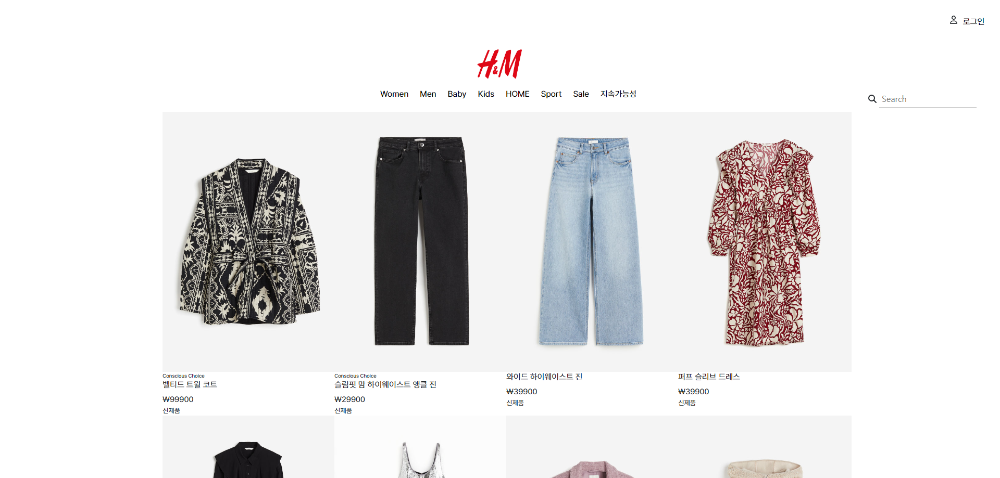
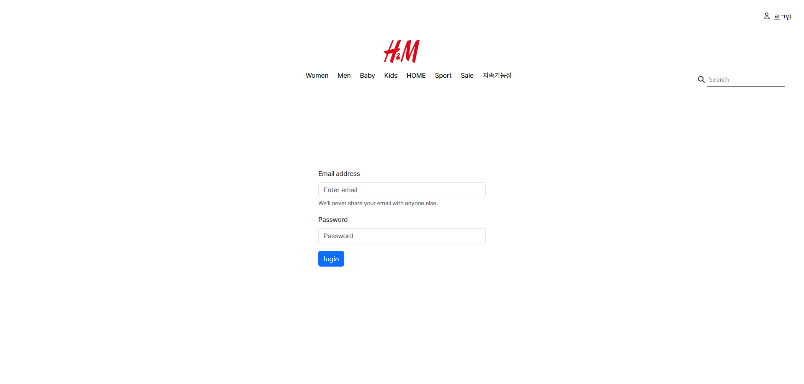
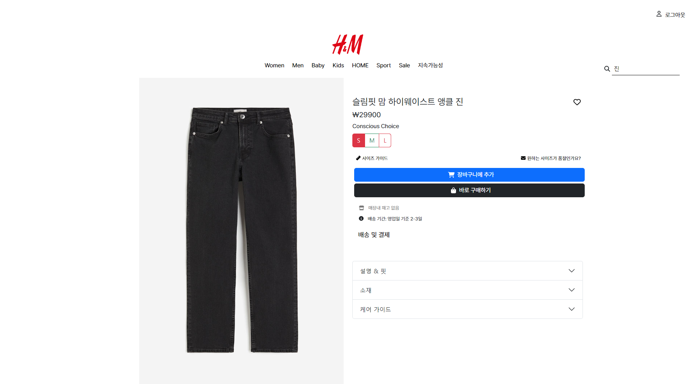
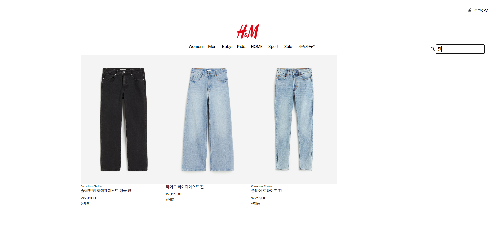
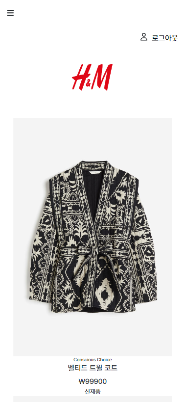
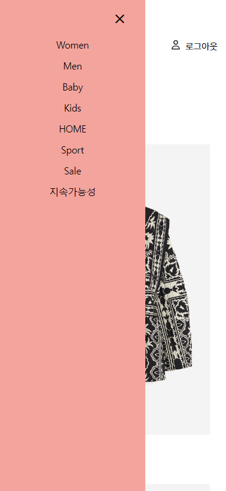
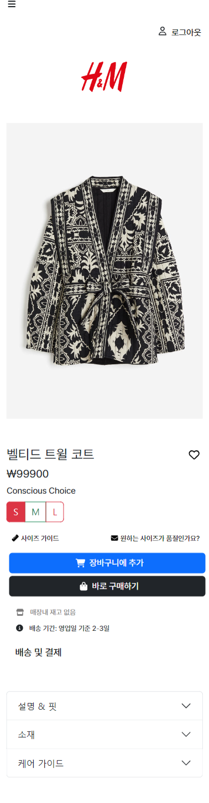

<h1>Shopping Mall Site</h1>

<h4>Project link : https://dh-hm.netlify.app/</h4>

---

<h2>구현기능</h2>

   유저는 메뉴와 상품들을 볼 수 있다. 
    유저는 로그인을 할 수 있다. 
    유저는 상품디테일을 보기 위해 로그인을 해야한다. 
    로그인한 유저는 상품디테일정보를 볼 수 있다. 
    유저는 상품을 검색할 수 있다. 
    유저는 로그아웃할 수 있다. 
    유저는 좋아하는 상품에 표시를 할 수 있다. 
  반응형 웹사이트다 

***

<h2>사이트 미리보기</h2>

<h3>반응형</h3>
***

